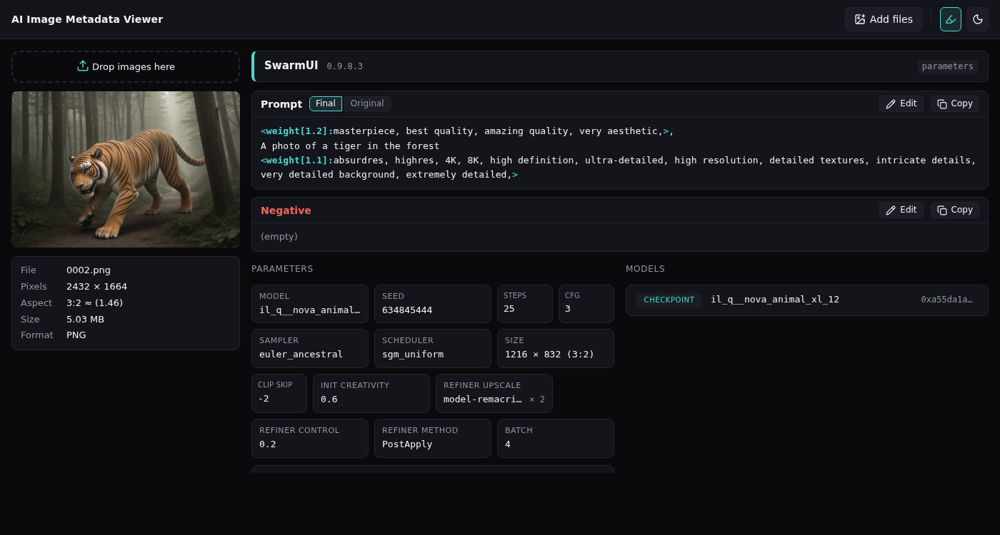
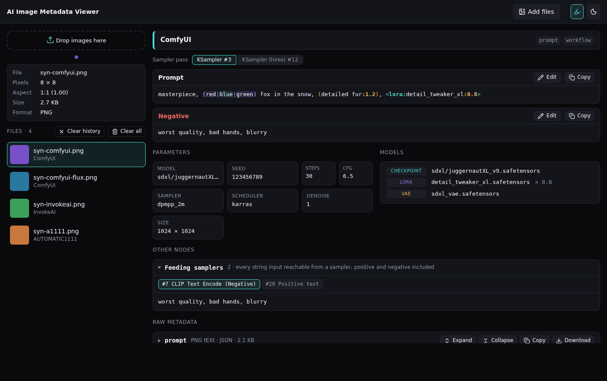

# AI Image Metadata Viewer

You generated a great picture three months ago. Or not you — you just found it in the deep dark web. What was the prompt? Which model? Which of the six LoRAs on the canvas were actually on? The answers are inside the PNG metadata, and this is the tool that reads them out: drop an image, get the prompt, the negative, the seed, the sampler, the models, and the raw ComfyUI graph as a tree you can actually unfold.

One HTML file. No install, no server, no account, no network.


## Getting started

- Grab **[ai-image-metadata-viewer.html](https://github.com/Techsorcist/ai-image-metadata-viewer/releases/latest)** from the latest release and open it in a browser. That is the entire installation. Keep it in Downloads, on a USB stick, bookmark it from `file://`, it does not care.
- Prefer not to download anything? The **[Online Demo](https://techsorcist.github.io/ai-image-metadata-viewer/)** is the same file served from GitHub Pages. Your images are still processed inside your browser and go nowhere.


## How it looks

*[Screenshots will be de-uglyfied]*






## What it reads

- PNG text chunks: `tEXt`, `iTXt`, `zTXt`, inflated right in the browser.
- **SwarmUI**, including the original prompt before wildcards were expanded.
- **ComfyUI**, from the API graph or from the UI workflow alone when that is all the file has. Bypassed and muted nodes are resolved, notes and unconnected prompt nodes are kept out of the prompt, and a second sampler pass shows up as a second pass, not as noise.
- **InvokeAI**, current and legacy formats.
- **AUTOMATIC1111 / Forge** and everything that writes the same `parameters` text.
- Fooocus, NovelAI, Easy Diffusion, Draw Things and unknown files are recognised and shown as raw chunks.

JPEG and WebP via EXIF `UserComment` are planned. Maybe.


## What it shows

- A card with Prompt, Negative, parameters, and models: checkpoint, LoRA, VAE, ControlNet, upscaler, with weights and hashes (if possible).
- For ComfyUI: a switch between sampler passes and every text node in the graph, grouped into the ones feeding samplers, the ones not connected to anything, and canvas notes.
- Syntax highlighting for prompts: weights, angle tags, `{a|b}` and `<random:...>` choices, `BREAK`, wildcards, comments. One button turns it off if you find it too cheerful.
- In-place editing after pressing Edit, with live highlighting. Copy takes the edited text, Reset brings the original back. Edits live in the page and never touch the file.
- Raw metadata as a lazy JSON tree with expand, collapse, copy and download. Nodes a ComfyUI workflow did not execute are labelled as such, so you stop wondering.
- Several files at once, newest on top, with per-file removal, Clear history and Clear all.
- Light and dark theme, following the system by default.


## Privacy first

Everything happens in your browser tab. The page makes no network requests at all: no analytics, no CDN, no update checks, no fonts from somewhere else. Unplug the network and it keeps working exactly the same, which is the easiest audit you will do this year.

It also flags values that look like private data, such as local paths with your user name or personal notes, so you can see what a PNG carries before you post it. It never modifies your files.


## Console mode

Optional, and entirely skippable. The viewer is the HTML page, and everything above works without this section; the console mode is a side door for people who would rather `grep` a folder of prompts than drag images into a browser. If that is not you, scroll on.

The same parsers, run from Python inside an embedded QuickJS ([quickjs-ng](https://github.com/genotrance/quickjs-ng)), so the terminal reads a file the way the page does. Just as read-only towards your images: it writes its own output and nothing else. PNG only for now, as in the browser.

It needs a clone of the repository, a POSIX shell and a `python3` of 3.10 or newer with the `venv` module (the one macOS ships may be older). `cli/aimeta` creates `cli/.venv` on the first run and again after `cli/requirements.txt` changes; that is when pip goes to the network for `quickjs-ng`, so the first run needs one, and until it succeeds every run tries again. Everything after that runs offline. Prebuilt wheels cover Linux on x86_64, ARM64 and i686, Apple Silicon and Windows; elsewhere (Intel Macs, 32-bit ARM) pip builds from source and wants a C compiler. Windows is not covered by the wrapper: make a venv by hand and run `python cli/aimeta.py`.

Call `cli/aimeta` directly, or put it on your `PATH`, from the repository root:

```sh
ln -s "$PWD/cli/aimeta" ~/.local/bin/aimeta
```

After a Python upgrade, remove `cli/.venv` and run again: the old venv still points at the packages of the previous interpreter. `aimeta` reminds you when it still gets to start.

Both commands take a detail level, `-l`:

- `basic` (default): prompt, negative, parameters, models. ComfyUI main sampler pass only, SwarmUI final prompt only.
- `card`: adds extra parameters, every sampler pass, ComfyUI text nodes, SwarmUI prompts before wildcards, notes.
- `full`: adds the raw metadata chunks (and, in JSON, the ComfyUI nodes that actually ran).

`view` prints to the terminal. From `card` up it marks private-looking extra parameters and ComfyUI text nodes with `[private]`; the raw chunks at `full` are not marked. The browser also marks string values inside JSON chunks, but no marker is a guarantee: before publishing an image, read its raw chunks yourself.

```sh
aimeta view image.png
aimeta view ~/Pictures/comfy/*.png
aimeta view -l card image.png
aimeta view -l full --color always image.png | less -R
```

`extract` writes the same data into files, as text or as JSON with the card model, and without the markers. Both commands also take `-f a1111`: the main prompt and settings the way A1111 writes them, ready for Read generation parameters in A1111 or Forge; basic level only, extra sampler passes are counted, not shown.

```sh
aimeta extract ~/gens                              # a.png -> a.txt next to it
aimeta extract -r --out-dir ~/meta ~/gens          # ~/gens/2026-09/a.png -> ~/meta/2026-09/a.txt
aimeta extract -f json --one all.jsonl ~/gens      # one JSON object per line
aimeta extract -f json --one - ~/gens | jq -r 'select(.positive.text | test("lighthouse")) | .file'
```

- Existing outputs are skipped, `--force` overwrites them. With `--one`, an existing file is an error until `--force`.
- `--force` only ever overwrites plain text files, such as last run's sidecars: that flag is about outputs, not about your images. Anything binary in the way is left alone and reported, whatever its name or format, through a symlink or a hard link, or as a `--one` value the shell took from `--one shots/*.png`.
- A directory contributes its `*.png` files only. A file named on the command line that is not a PNG is skipped and counted, so a rerun over `dir/*`, with or without `--force`, walks past the last run's sidecars without complaint.
- Two images with the same name from different folders into one `--out-dir` is an error for the second one, `--force` or not; give the common parent with `-r` and the folders are mirrored instead. The check compares paths as written, so on a case-insensitive filesystem `Foo.png` and `foo.png` slip past it, and with `--force` the second overwrites the first.
- A file with nothing to show at the chosen level gets no output, not even an empty one: images without metadata and, below `full`, generators that are only recognised, such as NovelAI.
- The summary goes to stderr, so `--one -` keeps stdout for the data. An error with a file sets exit code 1, and whatever could be read is still written; a usage error (bad or empty arguments, an existing `--one` file) is exit code 2 before anything is read.
- `-r` does not follow symlinked subdirectories.


## Development

- `index.dev.html` loads the sources from `src/` directly. Edit, reload, no build step.
- `./build.sh` glues everything into `ai-image-metadata-viewer.html` in the repository root. It needs a POSIX shell and nothing else. The built file is committed.
- `tools/test/` holds synthetic sample images from `tools/make-synthetic.py`; `tools/check.html` runs all of them through the parsers at once. Serve the project over HTTP first, `fetch` refuses to work from `file://`, as it should.
- `cli/tests/` holds regression tests for the console mode, standard library `unittest`: broken and odd PNGs are built inside the tests, the good ones come from `tools/test/`. Run `cli/.venv/bin/python -m unittest discover -s cli/tests` from the repository root, once `cli/aimeta` has created the venv.
- Every push to `master` redeploys the demo on GitHub Pages. Pushing a tag like `v1.2.0` creates a GitHub Release with the built file attached; the tag must match the version in `src/js/07-settings.js`, or the release job will tell you so and quit.


## Acknowledgements

Written from scratch, but on the shoulders of three earlier tools whose code and ideas were studied:

- [receyuki/stable-diffusion-prompt-reader](https://github.com/receyuki/stable-diffusion-prompt-reader) by Rhys Yang (MIT). The per-generator format modules and the ComfyUI graph traversal from the sampler nodes.
- [erroralex/metadata-viewer](https://github.com/erroralex/metadata-viewer) by Alexander Nilsson (MIT with Commons Clause). The two-column layout, the parameter cards and the overall visual style.
- [Xypher7/ai-image-metadata-editor](https://github.com/Xypher7/ai-image-metadata-editor) by Xypher7. The single-HTML-file approach, the hand-written PNG/JPEG/WebP chunk readers and the collapsible raw metadata view.

Thank you to all three authors :heart:

Icons are from [Lucide](https://lucide.dev) (ISC).
